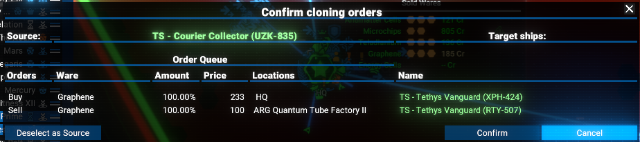
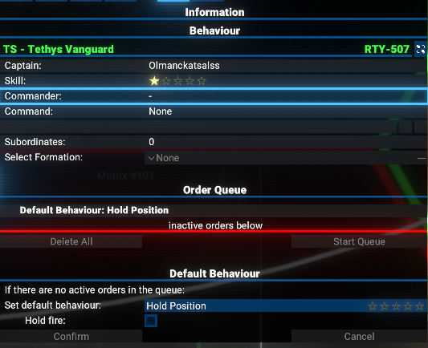
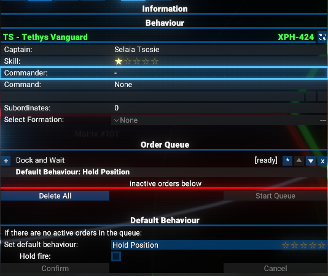
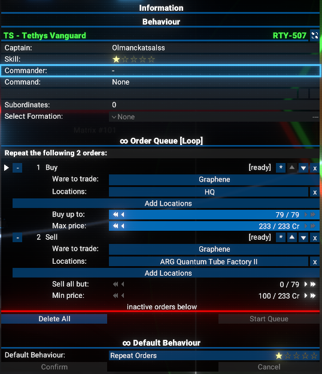
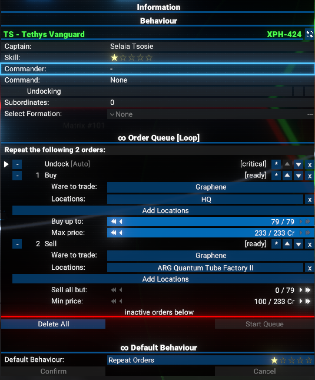

# Standing Orders

Standing Orders adds a lightweight interface that lets you clone a Repeat Orders queue from one of player's ship to any number of other player-owned ships.

## Features

- Clone a ship’s running Repeat Orders onto any selection of eligible targets in a single confirmation step.
- Works with **any** order that can be placed under Repeat Orders, not just trade orders - every parameter of every order is copied.
- Automatically scales cargo amounts to each target’s hold size, matching the transport type the order actually uses.
- Target ships only need cargo capacity when the source queue actually trades wares, so queues of non-trade orders can be cloned to any capable ship.

## Requirements

- `X4: Foundations` 7.60 or newer (tested on 7.60 and 8.00).
- `Mod Support APIs` by [SirNukes](https://next.nexusmods.com/profile/sirnukes?gameId=2659) to be installed and enabled. Version `1.93` and upper is required.
  - It is available via Steam - [SirNukes Mod Support APIs](https://steamcommunity.com/sharedfiles/filedetails/?id=2042901274)
  - Or via the Nexus Mods - [Mod Support APIs](https://www.nexusmods.com/x4foundations/mods/503)

## Installation

You can download the latest version via Steam client - [Standing Orders](https://steamcommunity.com/sharedfiles/filedetails/?id=3596138453)
Or you can do it via the Nexus Mods - [Standing Orders](https://www.nexusmods.com/x4foundations/mods/1871)

## Usage

This mods adds a several context menu options to the map UI when you right-click on a player-owned ships.

### Selecting Source Ship

To select a source ship (the one whose Repeat Orders you want to clone), right-click on it in the map view and choose `[∞]: Select as Source` from the context menu.

You will get warning messages if source ship is invalid. Some examples:

- the selected ship does not have any valid cargo.

  

- the selected ship has no active Repeat Orders enabled.

  

If the source ship is valid, map will be centered on it and ship will be selected on a map.

### Selecting Target Ships for Cloning Orders

To clone the Repeat Orders from the selected source ship to other player-owned ships, simple select them on a map or in the list, then right-click and choose `[∞]: Clone Standing Orders from <source ship>` from the context menu.

Again, you will get warning messages if no valid target ships are selected.

### Confirming Cloning

After selecting valid target ships, you will get a confirmation dialog showing the summary of the cloning operation.

You can confirm or cancel the operation.
In addition, you can `Deselect as Source` ship if you want to choose a different source ship.

### Deselecting Source Ship

To deselect the current source ship, right-click on it in the map view and choose `[∞]: Deselect as Source` from the context menu.

### Result of Cloning

After confirming the cloning operation, the selected target ships will receive the cloned Repeat Orders from the source ship.

#### Before Cloning

#### After Cloning

You can compare it with example of the source ship's Repeat Orders shown at the beginning of `Usage` chapter.

## Video

[Video demonstration of the Standing Orders. Version 1.00](https://www.youtube.com/watch?v=lTWG6vBWIhc)

## Credits

- Author: Chem O`Dun, on [Nexus Mods](https://next.nexusmods.com/profile/ChemODun/mods?gameId=2659) and [Steam Workshop](https://steamcommunity.com/id/chemodun/myworkshopfiles/?appid=392160)
- *"X4: Foundations"* is a trademark of [Egosoft](https://www.egosoft.com).

## Acknowledgements

- [EGOSOFT](https://www.egosoft.com) — for the X series.
- [SirNukes](https://next.nexusmods.com/profile/sirnukes?gameId=2659) — for the Mod Support APIs that power the UI hooks.
- [Forleyor](https://next.nexusmods.com/profile/Forleyor?gameId=2659) — for his constant help with understanding the UI modding!

## Changelog

### [1.01] - 2026-08-??

- Added
  - Any order that can run under Repeat Orders can now be cloned, not only Single Buy and Single Sell - all parameters of every order are copied, including radii, positions, price thresholds and object lists
  - The confirmation dialog now lists every order with all of its parameters, so you can see exactly what will be copied

- Changed
  - Cargo amounts are scaled using the transport type the order actually uses, instead of always assuming container cargo
  - Target ships are only required to have cargo capacity when the source queue actually trades wares
  - The target pilot skill requirement now matches the game's own Repeat Orders skill gate - some pilots that were previously accepted will now be rejected

- Removed
  - The unfinished **Add Location** button in the confirmation dialog, which could leave the map menu in a broken state

- Fixed
  - A source ship that was sold, destroyed, captured or wrecked is no longer kept selected - the context menu offers **Select as Source** again instead of a **Clone from** entry with an empty ship name
  - Cloning is aborted with a warning if the source ship stops being a valid source while the confirmation dialog is open, and target ships that became invalid in the meantime are skipped

- Changed
  - **Deselect as Source** is now available from any player-owned ship, not only from the source ship itself

### [1.00] - 2025-10-30

- Added
  - Initial public version
