# Standing Orders

Standing Orders adds a lightweight interface that lets you clone and edit a Repeat Orders queue from one of player's ship to any number of other player-owned ships.

## Features

- Clone a ship’s running Repeat Orders onto any selection of eligible targets in a single confirmation step.
- Works with **any** order that can be placed under Repeat Orders, not just trade orders - every parameter of every order is copied.
- Review and edit the queue before applying it, shown exactly as the map's **Behaviour** tab shows it.
- Optionally apply the edited queue back to the source ship as well.
- Automatically scales cargo amounts (if used as params) to each target’s hold size, matching the transport type the order actually uses.

## Requirements

- `X4: Foundations` 8.00 and 9.00. For 7.60 use the version 1.00 (as 2.00 required mods requires 8.00).
- `Mod Support APIs` by [SirNukes](https://next.nexusmods.com/profile/sirnukes?gameId=2659) to be installed and enabled. Version `1.95` and upper is required.
  - It is available via Steam - [SirNukes Mod Support APIs](https://steamcommunity.com/sharedfiles/filedetails/?id=2042901274)
  - Or via the Nexus Mods - [Mod Support APIs](https://www.nexusmods.com/x4foundations/mods/503)
- `Options Helper`, to provide the in-game Debug Level option. Version `1.10` and upper is required.
  - It is available via Steam - [Options Helper](https://steamcommunity.com/sharedfiles/filedetails/?id=3715253556)
  - Or via the Nexus Mods - [Options Helper](https://www.nexusmods.com/x4foundations/mods/2089)
- `Print Extension List`, to record the game version and the enabled extensions in the log. Version `1.01` and upper is required.
  - It is available via Steam - [Print Extension List](https://steamcommunity.com/sharedfiles/filedetails/?id=3770927339)
  - Or via the Nexus Mods - [Print Extension List](https://www.nexusmods.com/x4foundations/mods/2191)

## Installation

You can download the latest version via Steam client - [Standing Orders](https://steamcommunity.com/sharedfiles/filedetails/?id=3596138453)
Or you can do it via the Nexus Mods - [Standing Orders](https://www.nexusmods.com/x4foundations/mods/1871)

## Usage

This mods adds a several context menu options to the map UI when you right-click on a player-owned ships.

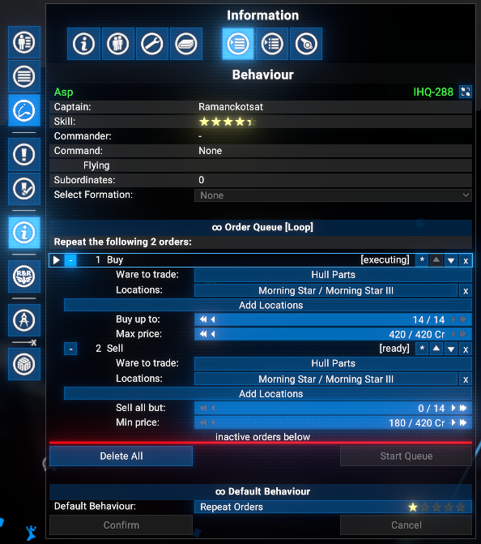

### Selecting Source Ship

To select a source ship (the one whose Repeat Orders you want to clone), right-click on it in the map view and choose `[∞]: Select as Source` from the context menu.
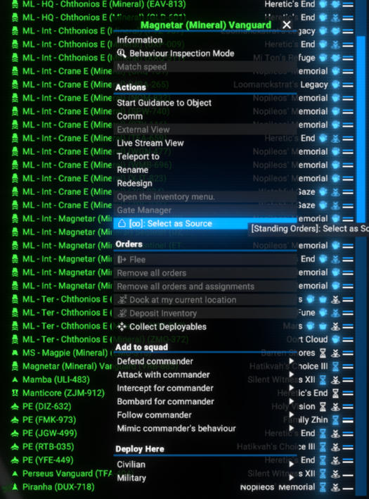

You will get warning messages if source ship is invalid. Some examples:

- the selected ship does not have any valid cargo.

  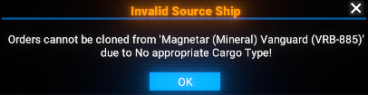

- the selected ship has no active Repeat Orders enabled.

  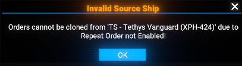

If the source ship is valid, map will be centered on it and ship will be selected on a map.

### Selecting Target Ships for Cloning Orders

To clone the Repeat Orders from the selected source ship to other player-owned ships, simple select them on a map or in the list, then right-click and choose `[∞]: Clone Standing Orders from <source ship>` from the context menu.

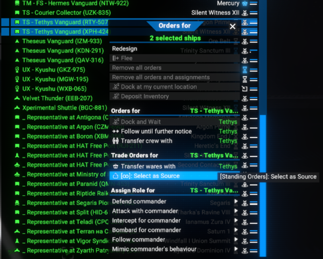

Again, you will get warning messages if no valid target ships are selected.

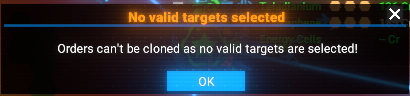

### Cloning Dialog

After selecting valid target ships, you will get a dialog showing the summary of the cloning operation.

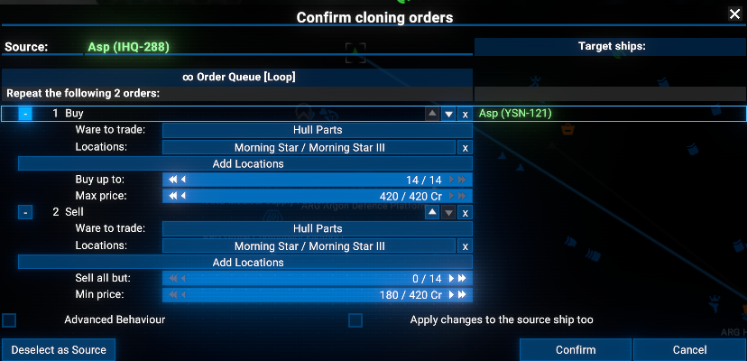

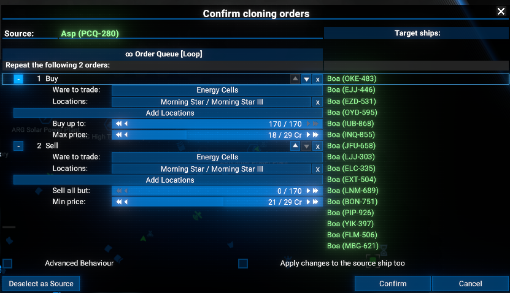

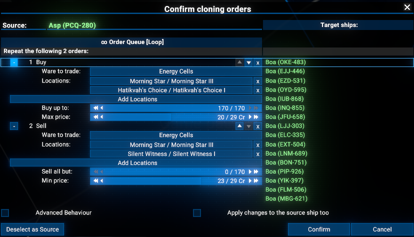

You can confirm or cancel the operation.
In addition, you can `Deselect as Source` ship if you want to choose a different source ship.

### Deselecting Source Ship

To deselect the current source ship, right-click on it in the map view and choose `[∞]: Deselect as Source` from the context menu.

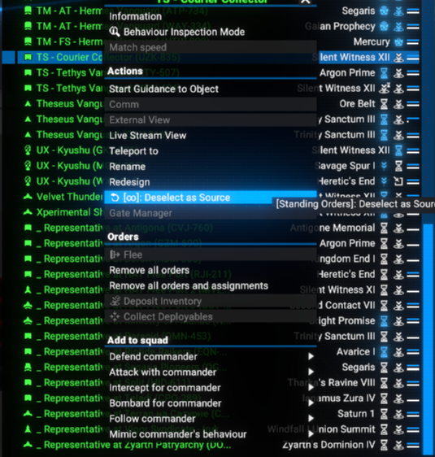

### Result of Cloning

After confirming the cloning operation, the selected target ships will receive the cloned Repeat Orders from the source ship.

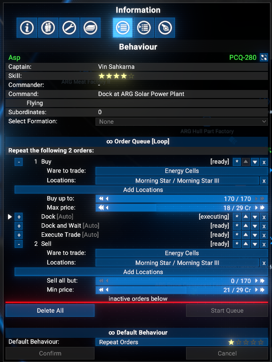

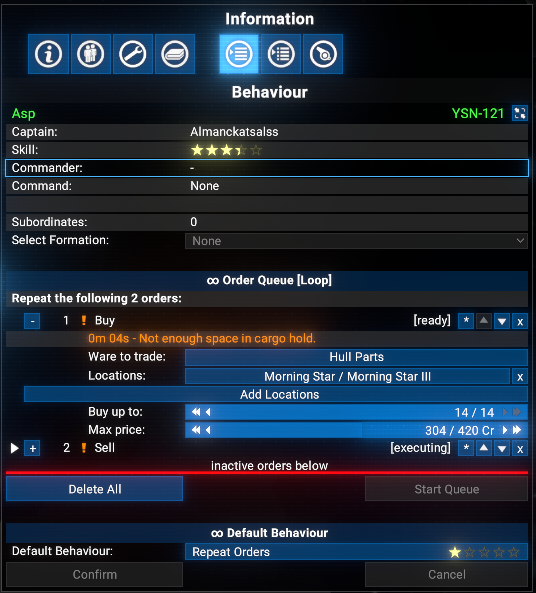

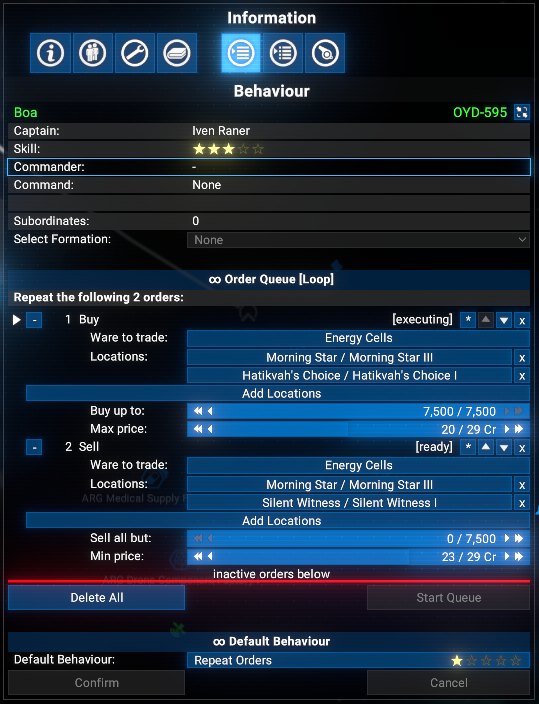

## Extension Options

The mod adds a `Standing Orders` page to `Settings` - `Extensions Options`, with a single setting:

- **Debug Level** - how much the mod writes to the game log. `None` is the default and keeps the log clean, `Debug` records one line per action taken, and `Trace` adds the per-ship and per-order detail. Use `Debug` or `Trace` when preparing a bug report, then set it back to `None`.

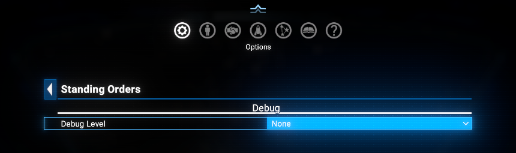

The setting takes effect immediately, no reload needed.

## Video

[Video demonstration of the Standing Orders. Version 1.00](https://www.youtube.com/watch?v=lTWG6vBWIhc)

## Credits

- Author: Chem O`Dun, on [Nexus Mods](https://next.nexusmods.com/profile/ChemODun/mods?gameId=2659) and [Steam Workshop](https://steamcommunity.com/id/chemodun/myworkshopfiles/?appid=392160)
- *"X4: Foundations"* is a trademark of [Egosoft](https://www.egosoft.com).

## Acknowledgements

- [EGOSOFT](https://www.egosoft.com) — for the X series.
- [SirNukes](https://next.nexusmods.com/profile/sirnukes?gameId=2659) — for the Mod Support APIs that power the UI hooks.
- [Forleyor](https://next.nexusmods.com/profile/Forleyor?gameId=2659) — for his constant help with understanding the UI modding!

## Changelog

### [2.00] - 2026-08-07

- Improved
  - Fully refactored to work with any order in Repeat Orders queue.
  - Uses the UI equal to the map's Behaviour tab to show the orders.
  - Allows changing any parameter of the orders before applying them to the target ships.
  - Allows applying the edited queue back to the source ship as well.
- Added
  - `Extensions Options` page with a `Debug Level` setting - `None`, `Debug` or `Trace`.
- Changed
  - `Options Helper` and `Print Extension List` are now required, and `Mod Support APIs` `1.95` is the minimum version.

### [1.00] - 2025-10-30

- Added
  - Initial public version
